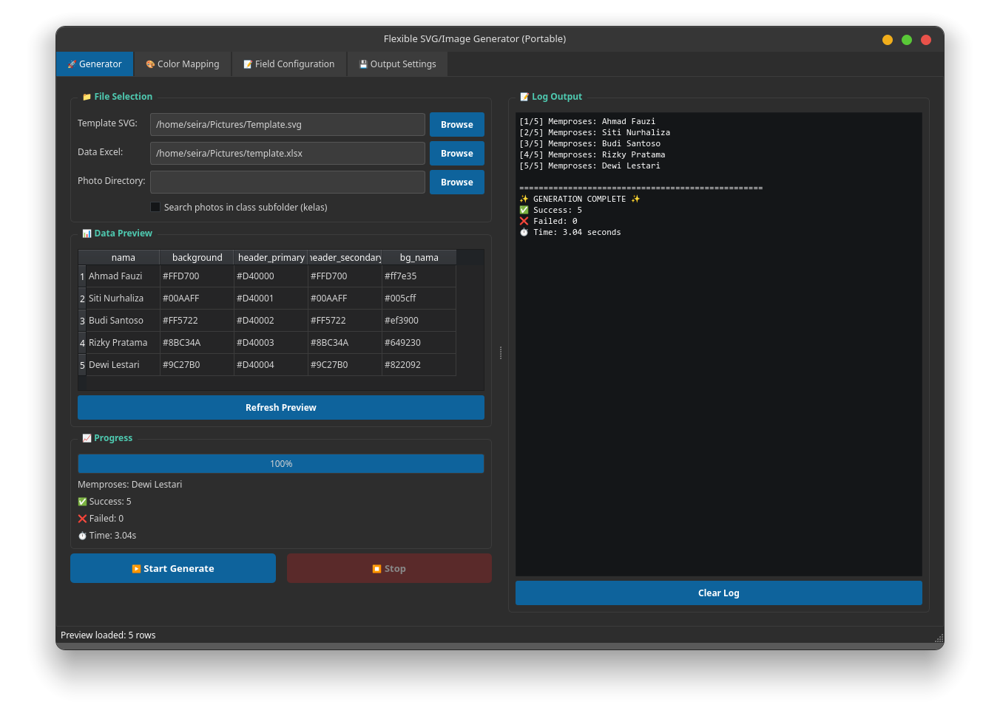
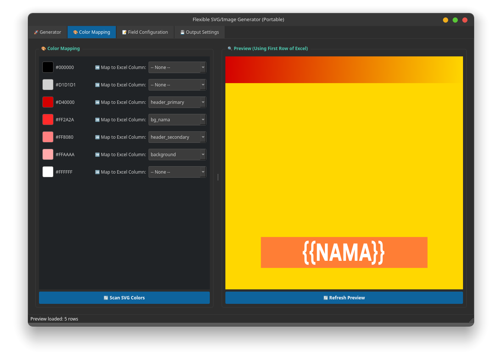
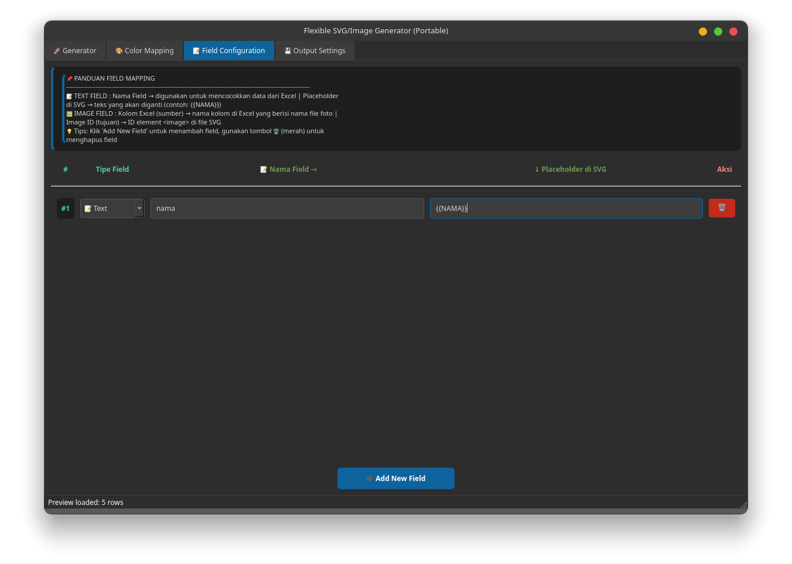
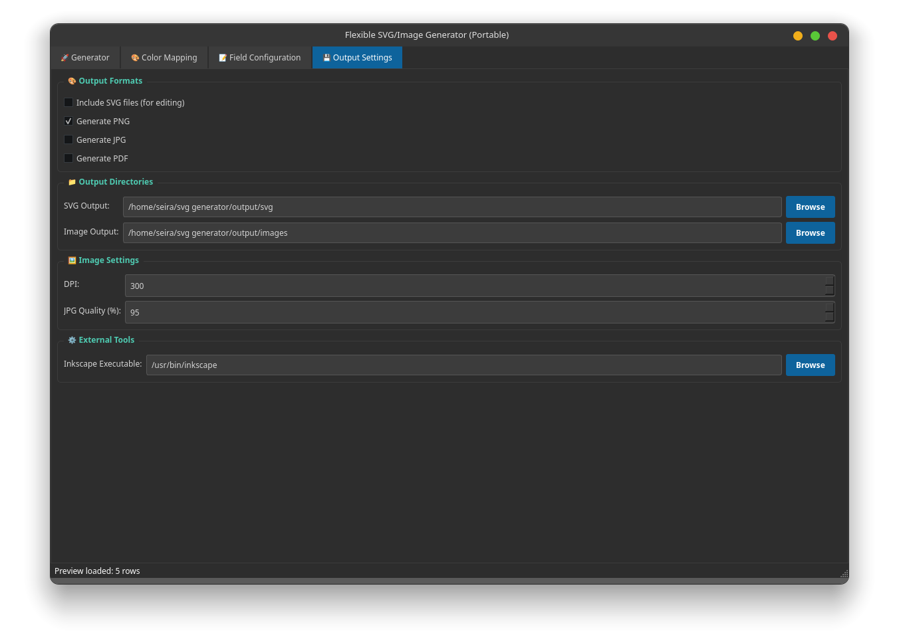

# SVG Image Generator

Generate ribuan sertifikat, ID Card, Piagam, Name Tag, atau dokumen berbasis SVG secara otomatis menggunakan data Excel dan foto peserta.


---

## Screenshot






---
## ✨ Fitur Utama

### 📄 SVG Template Engine

Gunakan template SVG yang dibuat dari:

- Inkscape
- Adobe Illustrator
- CorelDraw (export SVG)
- Figma (export SVG)

---

### 📊 Excel Data Source

Mendukung:

```text
.xlsx
.xls
```

Contoh:

| Nama | Kelas | HeaderColor | BorderColor |
|--------|--------|------------|------------|
| Ahmad | XII IPA 1 | #FFD700 | #AA8800 |
| Siti | XII IPS 2 | #00AEEF | #005577 |

---

### 🖼️ Photo Integration

Otomatis memasukkan foto peserta ke dalam template.

Struktur:

```text
photos/
├── Ahmad.jpg
├── Siti.jpg
└── Budi.jpg
```

atau

```text
photos/
├── XII IPA 1/
│   ├── Ahmad.jpg
│   └── Budi.jpg
└── XII IPS 2/
    └── Siti.jpg
```

---

### 🎨 Dynamic Color Mapping

Deteksi warna langsung dari SVG.

Contoh:

Template memiliki warna:

```svg
fill="#B846FF"
```

Mapping:

```text
#B846FF → HeaderColor
```

Nilai warna akan diambil dari Excel.

Hasil:

```text
Baris 1 → Gold
Baris 2 → Blue
Baris 3 → Green
```

tanpa membuat template baru.

---

### 👀 Live Preview

Preview hasil langsung di aplikasi menggunakan:

- Data baris pertama Excel
- Mapping warna aktif
- Placeholder SVG

---

### 📤 Export Format

Mendukung:

- SVG
- PNG
- JPG
- PDF

---

## 📂 Struktur Project

```text
Flexible-SVG-Generator/
├── main.py
├── start.sh
├── start.bat
│
├── config/
│   └── default.json
│
├── templates/
│
├── photos/
│
├── themes/
│
├── output/
│   ├── svg/
│   └── images/
│
├── logs/
│
├── core/
│
└── tabs/
```

---

## 🚀 Menjalankan Aplikasi

### Linux

```bash
chmod +x start.sh
./start.sh
```

atau

```bash
python3 main.py
```

---

### Windows

```bat
start.bat
```

atau

```bat
python main.py
```

---

## 📦 Install Dependency

```bash
pip install -r requirements.txt
```

---

## 🖌️ Membuat Template SVG

Direkomendasikan menggunakan:

### Inkscape

Buat desain seperti biasa.

Contoh placeholder:

```text
{{NAMA}}
{{KELAS}}
{{SEKOLAH}}
```

Saat generate:

```text
{{NAMA}}
```

akan diganti dengan data Excel.

---

## 🎨 Color Mapping Workflow

### Langkah 1

Buat desain SVG.

Misal warna header:

```text
#B846FF
```

---

### Langkah 2

Buka tab:

```text
🎨 Color Mapping
```

Klik:

```text
Scan SVG Colors
```

---

### Langkah 3

Map warna:

```text
#B846FF → HeaderColor
```

---

### Langkah 4

Excel:

| Nama | HeaderColor |
|--------|------------|
| Ahmad | #FFD700 |
| Siti | #00AEEF |

---

### Hasil

Header setiap sertifikat akan otomatis berubah sesuai warna pada Excel.

---

## 📷 Mapping Foto

Excel:

| Nama | Foto |
|--------|--------|
| Ahmad | Ahmad.jpg |
| Siti | Siti.jpg |

Generator akan mencari foto dari folder:

```text
photos/
```

atau

```text
photos/<kelas>/
```

jika opsi:

```text
Search photos in class subfolder
```

aktif.

---

## ⚙️ Konfigurasi

Semua konfigurasi disimpan di:

```text
config/default.json
```

Contoh:

```json
{
  "template_file": "templates/certificate.svg",
  "data_file": "data.xlsx",
  "output_formats": ["png"],
  "image_dpi": 300
}
```

---

## 📝 Log

Log aplikasi:

```text
logs/app.log
```

Log generate:

```text
logs/generate.log
```

---

## 🏗️ Build Executable

### Linux

```bash
pyinstaller main.py --onedir
```

### Windows

```bash
pyinstaller main.py --onedir --noconsole
```

---

## 💡 Contoh Penggunaan

### Sertifikat Sekolah

Generate:

```text
1000 Sertifikat
```

dalam sekali klik.

---

### ID Card

Generate:

```text
500 ID Card Peserta
```

menggunakan foto otomatis.

---

### Piagam Lomba

Generate:

```text
Juara 1
Juara 2
Juara 3
```

dengan warna berbeda berdasarkan data Excel.

---

## Dibangun Dengan

- Python
- PyQt6
- Pandas
- lxml
- Inkscape
- SVG

---

## License

MIT License